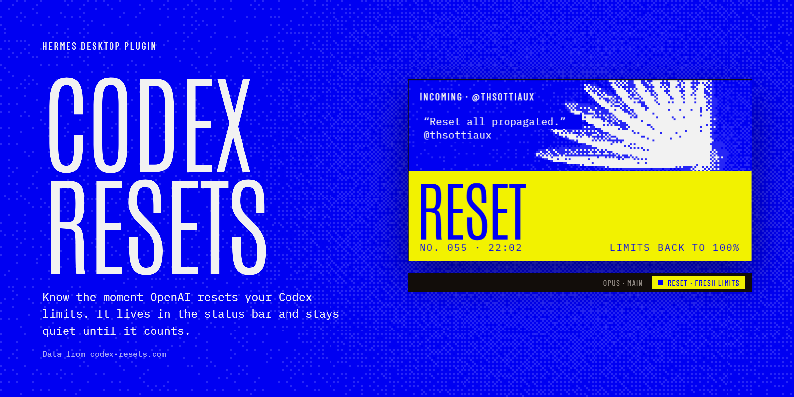
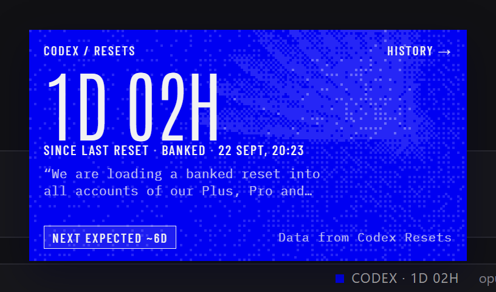
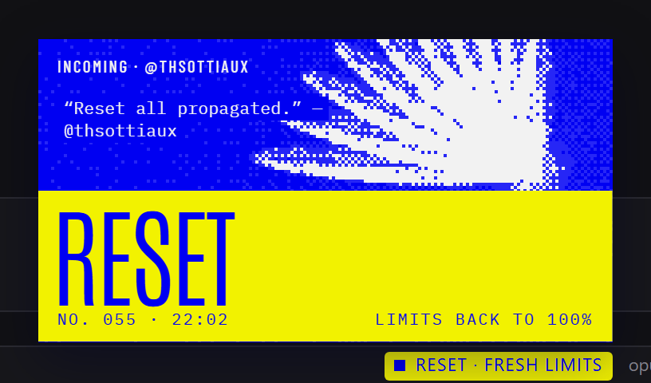
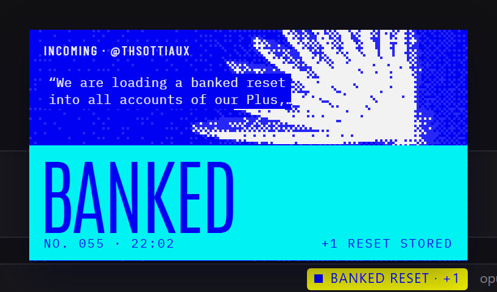
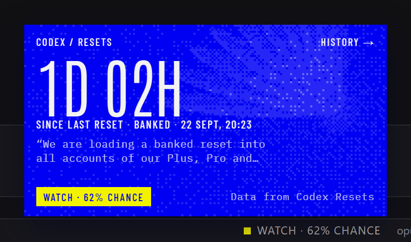
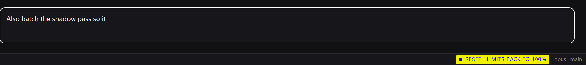
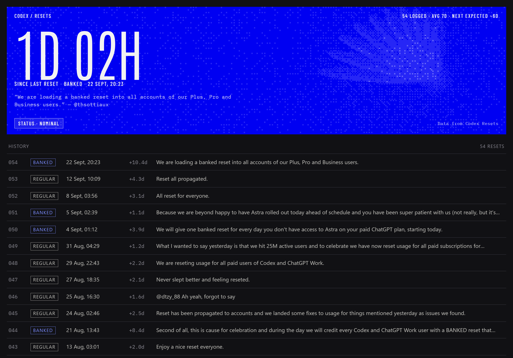

# Codex Resets for Hermes

A **Hermes Desktop plugin** that tells you the moment OpenAI resets Codex usage limits. A small chip in the status bar counts the time since the last reset. When a new one is announced, a card rises out of the chip, floods yellow, and sinks back. The rest of the time it stays out of your way.

[](https://github.com/sxuff/hermes-codex-resets/releases) [](https://github.com/sxuff/hermes-codex-resets/actions/workflows/ci.yml)  



Data from [Codex Resets](https://codex-resets.com), which tracks reset announcements from [@thsottiaux](https://x.com/thsottiaux). This plugin is not affiliated with OpenAI or Nous Research.

## What you get

| | |
|---|---|
|  | **Status card.** Click the chip. Time since the last reset, whether it was regular or banked, the sentence from the announcement that actually mentions the reset, and when the next one is expected at the current average. **History →** opens the full list. |
|  | **A reset lands.** The card rises by itself, floods yellow, and sinks back into the chip after about five seconds. Hover or click to keep it open. The chip stays yellow for 30 minutes. |
|  | **Banked resets** flood cyan and say what they mean: one reset stored, to spend when you hit a limit. |
|  | **Watch.** When codex-resets.com's forecast says a reset is likely, or one has been scheduled, the chip says so. The forecast is AI-classified, not an OpenAI commitment, and the card says that too. |

**While you're typing**, only the chip reacts. The card waits until you pause.



**History** lists every reset, how long after the previous one it came, and links each row to the original post.



## How it behaves

| When | What you see |
|---|---|
| Nothing happening | `CODEX · 1D 01H` in the status bar. Nothing moves. |
| You click the chip | The status card, anchored to the chip. Click away or press Esc to close. |
| A watch or a scheduled reset | The chip reads `WATCH · 62% CHANCE`. One in-app toast per hint. |
| Past the average interval | The chip adds `· +2D`. |
| A reset lands | The card rises, floods, and sinks back. |
| A reset lands while you type | The chip sweeps yellow. The card rises once you've stopped typing for 8 seconds. |
| A reset lands while Hermes is in the background | A system notification, then the card plays once when you come back, marked "While you were away". |

It never announces a reset from before it was installed, and never replays an older one if the source corrects an entry.

## Install

This is a desktop plugin. Install it on the machine that runs the **Hermes desktop app**, not on a remote gateway.

**One click** (opens Hermes Desktop and asks before installing anything):

```
hermes://plugin/install?repo=sxuff/hermes-codex-resets
```

**From the CLI:**

```bash
hermes plugins install sxuff/hermes-codex-resets
```

Then turn on **Codex Resets** in Capabilities → Plugins. Desktop plugins install switched off.

**By hand:** download `plugin.js` from the [latest release](https://github.com/sxuff/hermes-codex-resets/releases/latest) (or [`desktop/plugin.js`](desktop/plugin.js)) and save it as `$HERMES_HOME/desktop-plugins/hermes-codex-resets/plugin.js` (`~/.hermes/...` unless you moved `HERMES_HOME`; the folder name must be `hermes-codex-resets`). Hermes picks it up within seconds; if not, press Ctrl+K and run **Reload desktop plugins**.

To see it without waiting for a real reset, press Ctrl+K and run **Codex resets: preview reset moment**. Click somewhere outside the message box first, or you'll get the typing version.

### Requirements

- Hermes Agent desktop app 0.21 or later. Tested with the desktop app 0.21.3 on Windows.
- Network access to `codex-resets.com`.

## Try it in a browser

[sxuff.github.io/hermes-codex-resets/demo/](https://sxuff.github.io/hermes-codex-resets/demo/) runs the real `plugin.js` against a stand-in for the Hermes window. The status data is live; the window and any reset you land there are simulated. Buttons on the left land a reset, start typing, put the window in the background, or switch the data to a watch, a scheduled reset, or an overdue cycle.

## Commands

| Command palette | Does |
|---|---|
| Codex resets: show status | Opens the status card |
| Codex resets: open history | Opens the history page |
| Codex resets: check now | Refreshes from codex-resets.com |
| Codex resets: preview reset moment | Plays a regular reset with sample data |
| Codex resets: preview banked reset moment | Plays a banked reset with sample data |

## What it touches

- **Network:** `GET https://codex-resets.com/api/v1/status` every 60 seconds and when the window regains focus; `GET /api/v1/resets` when you open History; fonts from Google Fonts. Nothing about you or your sessions is sent anywhere.
- **Storage:** two values in the plugin's own Hermes storage: when it last saw a reset, and the last hint it toasted.
- **Hermes:** desktop UI only. No tools, hooks, gateway calls, Python, or configuration changes.
- **Motion:** the dithered wing redraws at about 11 fps while the card is open, at 60 fps only during a reset, and not at all when the window is hidden. With reduced motion on, it draws once and nothing animates.

## Development

```bash
npm ci
npx playwright install chromium   # once, for captures
npm run check     # parse, import allowlist, and lint checks on desktop/plugin.js
npm run demo      # serves the browser demo at http://127.0.0.1:4321/demo/
npm run capture   # regenerates the screenshots and banner in artifacts/
hermes plugins validate .
```

Commit conventions and the release process are in [CONTRIBUTING.md](CONTRIBUTING.md).

The plugin is one plain ES module, written without JSX or a build step, as Hermes loads desktop plugins. It imports only `@hermes/plugin-sdk`, `react` and `react/jsx-runtime`. `demo/mock-sdk.js` is a small stand-in for the SDK surface the plugin uses; it is not the real SDK. `demo/index.html?legacy` removes the context helpers that Hermes 0.21 lacks, to check the fallbacks.

## License

[MIT](LICENSE). Data from [Codex Resets](https://codex-resets.com), used under its free API terms, which ask for the attribution link the card shows.
